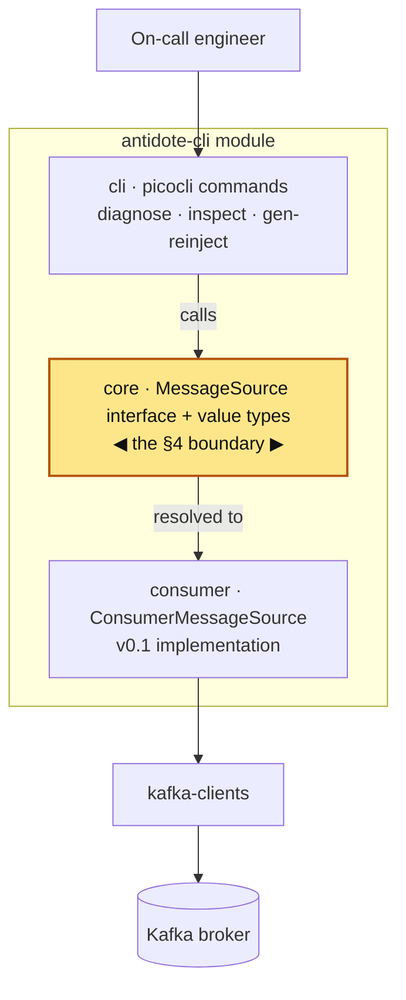
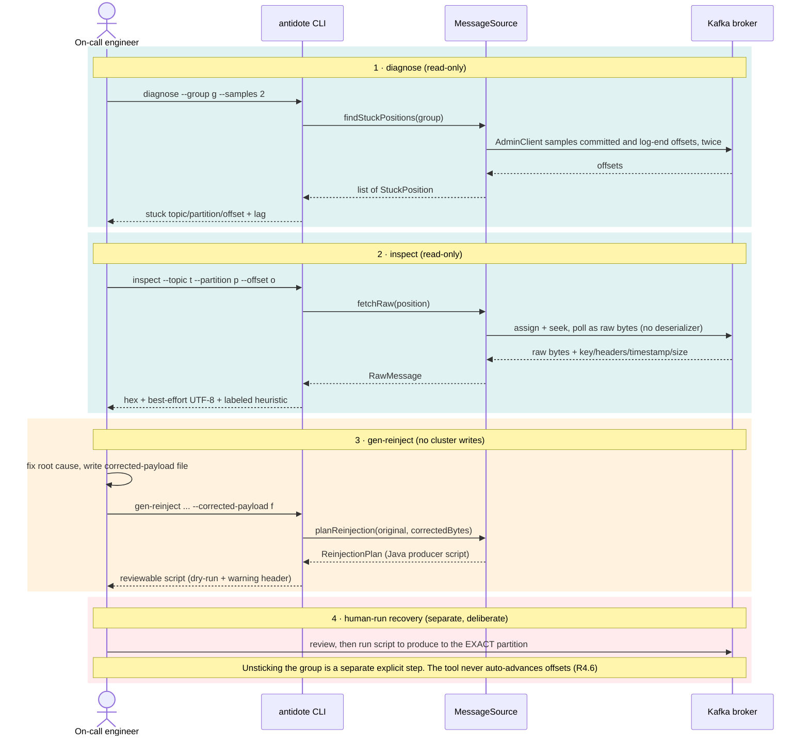

# Kafka Antidote

A command-line tool that connects to a Kafka **consumer group**, finds the offset stuck on a
poison pill, dumps the un-deserializable payload for inspection, and generates a **safe**
re-injection script.

> **Status:** early development. **Phase 0 (skeleton & test harness) is complete.** The `diagnose`,
> `inspect`, and `gen-reinject` commands exist with full `--help` but their logic lands in later
> phases (they currently exit with code `64`, "not implemented in this phase").

## Requirements

- **JDK 17+** (built and tested on JDK 21)
- **Maven 3.9+**
- **Docker** running — the integration tests use [Testcontainers](https://testcontainers.com/) to
  spin up a real, disposable Kafka broker. No local broker or production cluster is ever used.

## Module layout

```
kafka-antidote/
├── poison-fixtures/   # standalone corpus generator: the 5 poison-pill payload types
└── antidote-cli/      # the CLI tool
    ├── core/          # MessageSource boundary + immutable value types
    └── cli/           # picocli commands: diagnose, inspect, gen-reinject
```

## Architecture

The whole design turns on **one boundary** (Spec §4.4): the CLI, the payload inspector, the
classifier, and the re-injection generator depend **only** on the `MessageSource` interface and the
immutable value types — never on Kafka classes directly. That is what lets future Kafka Streams and
Connect support be added later as new `MessageSource` implementations without touching anything else.



The highlighted `core` package is the boundary. The CLI calls only the `MessageSource` interface and
the immutable value types (`GroupCoordinates`, `StuckPosition`, `TopicPartitionOffset`, `RawMessage`,
`ReinjectionPlan`, `FailureClassification`); the one v0.1 implementation, `ConsumerMessageSource`,
plugs in behind it and is the only code that touches `kafka-clients`. Adding a future
`StreamsMessageSource` or `ConnectMessageSource` means adding a sibling implementation at the same
seam — nothing above the boundary changes. (The `poison-fixtures` module is a separate, test-only
corpus generator and is not part of the runtime call path.)

## End-to-end data flow

The tool's job is **diagnose → inspect → hand off a safe script**. Steps 1–3 never write to or mutate
the cluster; only the human, in step 4, produces anything — and even then, re-injection preserves
data without unsticking the group (Spec R4.6).



## Testing Phase 0

Phase 0's Definition of Done is: `--help` runs; the fixture generator emits all five poison types;
and a real broker starts, receives a produced fixture, and reads it back byte-for-byte.

### 1. Fast unit tests (no Docker)

Runs the fixture-generator tests and the CLI `--help` tests via Surefire:

```bash
mvn test
```

Expected: **9 tests, all passing** (`PoisonFixtureGeneratorTest`, `HelpTest`).

### 2. Full verification, including the real-broker integration test (Docker required)

Make sure Docker is running first, then:

```bash
mvn verify
```

This additionally runs `KafkaRoundTripIT`, which starts a Kafka container, produces a poison
fixture, and consumes it back as raw bytes. Expected: **10 tests total, all passing**, and the fat
jar built at `antidote-cli/target/antidote.jar`.

> **Apple Silicon note:** the tests use the GraalVM-native `apache/kafka-native` image. The
> JVM-based `apache/kafka` image crashes (`SIGILL`) under Docker emulation on arm64 Macs.

### 3. Run the packaged CLI

After `mvn verify` (or `mvn package`) has built the jar:

```bash
java -jar antidote-cli/target/antidote.jar --help
```

```bash
java -jar antidote-cli/target/antidote.jar diagnose --help
```

You should see the top-level usage listing the three subcommands, each with its own `--help` and a
usage example.

## Safety

`diagnose` and `inspect` are strictly read-only — they never commit, seek, or otherwise mutate a
consumer group's offsets. Re-injection **preserves data but does not unstick the group**; advancing
past a poison pill is always a separate, deliberate, human-initiated action.
