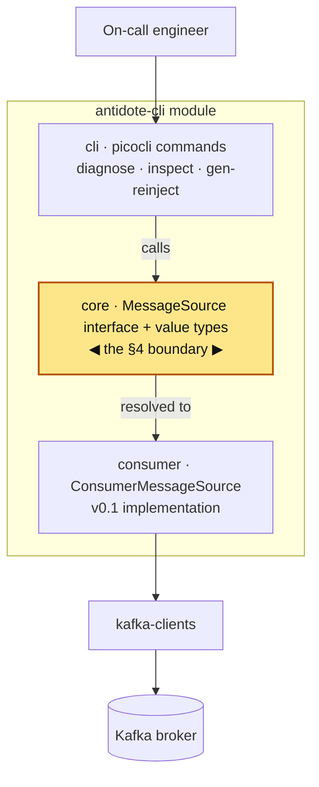
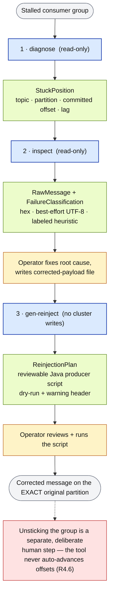

# Kafka Antidote

A command-line tool that connects to a Kafka **consumer group**, finds the offset stuck on a
poison pill, dumps the un-deserializable payload for inspection, and generates a **safe**
re-injection script.

> **Status:** early development. **Phase 0 (skeleton & test harness) is complete.** The `diagnose`,
> `inspect`, and `gen-reinject` commands exist with full `--help` but their logic lands in later
> phases (they currently exit with code `64`, "not implemented in this phase").

## Requirements

- **JDK 17+** (built and tested on JDK 21)
- **Maven 3.9+**
- **Docker** running — the integration tests use [Testcontainers](https://testcontainers.com/) to
  spin up a real, disposable Kafka broker. No local broker or production cluster is ever used.

## Module layout

```
kafka-antidote/
├── poison-fixtures/   # standalone corpus generator: the 5 poison-pill payload types
└── antidote-cli/      # the CLI tool
    ├── core/          # MessageSource boundary + immutable value types
    └── cli/           # picocli commands: diagnose, inspect, gen-reinject
```

## Architecture

The whole design turns on **one boundary** (Spec §4.4): the CLI, the payload inspector, the
classifier, and the re-injection generator depend **only** on the `MessageSource` interface and the
immutable value types — never on Kafka classes directly. That is what lets future Kafka Streams and
Connect support be added later as new `MessageSource` implementations without touching anything else.



The highlighted `core` package is the boundary. The CLI calls only the `MessageSource` interface and
the immutable value types (`GroupCoordinates`, `StuckPosition`, `TopicPartitionOffset`, `RawMessage`,
`ReinjectionPlan`, `FailureClassification`); the one v0.1 implementation, `ConsumerMessageSource`,
plugs in behind it and is the only code that touches `kafka-clients`. Adding a future
`StreamsMessageSource` or `ConnectMessageSource` means adding a sibling implementation at the same
seam — nothing above the boundary changes. (The `poison-fixtures` module is a separate, test-only
corpus generator and is not part of the runtime call path.)

## End-to-end data flow

The tool runs as a pipeline: each stage consumes the previous stage's output and produces a new
artifact. The three tool stages are strictly **read-only**; the only cluster write is the human
running the generated script at the end — and even that preserves data without unsticking the group
(Spec R4.6).

**Legend:** 🟦 read-only tool step · 🟩 data artifact produced · 🟧 human action · 🟥 safety invariant



## Building & testing

### 1. Fast unit tests (no Docker)

Runs the pure-logic tests via Surefire — fixtures, CLI help, the stuck-offset decision, and
duration parsing:

```bash
mvn test
```

Expected: **16 tests, all passing** (`PoisonFixtureGeneratorTest`, `HelpTest`, `StuckDetectorTest`,
`DurationParserTest`).

### 2. Full verification, including real-broker integration tests (Docker required)

Make sure Docker is running first, then:

```bash
mvn verify
```

This additionally runs the integration tests against a real Kafka container — `KafkaRoundTripIT`
(produce/read-back) and `DiagnoseIT` (the R1 stuck-offset contract). Expected: **23 tests total, all
passing**, and the fat jar built at `antidote-cli/target/antidote.jar`.

> **Apple Silicon note:** the tests use the GraalVM-native `apache/kafka-native` image. The
> JVM-based `apache/kafka` image crashes (`SIGILL`) under Docker emulation on arm64 Macs.

### 3. Run the packaged CLI

After `mvn verify` (or `mvn package`) has built the jar:

```bash
java -jar antidote-cli/target/antidote.jar --help
```

```bash
java -jar antidote-cli/target/antidote.jar diagnose --help
```

You should see the top-level usage listing the three subcommands, each with its own `--help` and a
usage example.

## Verifying Phase 1 — detect the stuck offset (Spec R1)

Three levels of confidence, cheapest first.

### 1. Run the suite (the gate)

```bash
mvn verify
```

Expect `BUILD SUCCESS` and **23 tests, 0 failures**. Each Phase-1 requirement maps to a test:

| Spec req | Test | What it proves |
|---|---|---|
| **R1.1** two-sample detection | `StuckDetectorTest.advancingCommittedIsNotStuck` / `...IsStuck` | a *moving* offset is not flagged; a *frozen* one with lag is |
| **R1.2** report numbers | `DiagnoseIT.detectsStuckPartitionWithCorrectNumbers` | committed=2, log-end=5, lag=3 exactly |
| **R1.3** no-poison path | `DiagnoseIT.noPoisonWhenCaughtUp`, `...ExitsOkWhenNoPoison` | empty result, exit 0 |
| **R1.4** read-only | `DiagnoseIT.detectionDoesNotMutateOffsets` | committed offset identical before/after diagnose |
| **R5.1 / R5.5** command + exit codes | `DiagnoseIT.diagnoseCommandExits*` | exit 1 when stuck, 0 when clean |

### 2. Prove the tests actually bite

Confirm a test would fail if the feature broke. Edit
[`StuckDetector.java`](antidote-cli/src/main/java/com/kafkaantidote/consumer/StuckDetector.java) so
it ignores whether the offset moved:

```java
boolean committedStationary = true; // sabotage: was baseline.committed() == now.committed()
```

Then run the fast tests:

```bash
mvn -q test
```

`advancingCommittedIsNotStuck` should now **fail** — the R1.1 "slow ≠ stuck" guarantee doing its job.
Revert the line and it's green again.

### 3. Watch it work live (Docker required)

Boots a disposable broker, creates a consumer group stuck at offset 2 (lag 3), and runs the real
`diagnose` command:

```bash
./demo.sh
```

Expected output:

```
Poison pill(s) detected in group 'orders-consumer' @ localhost:PORT:

  orders partition 0
    committed offset : 2
    log-end offset   : 5
    lag              : 3

Next: inspect the payload —
  antidote inspect --bootstrap localhost:PORT --topic orders --partition 0 --offset 2
 exit code = 1   (0=clean, 1=poison detected)
```

The demo lives in `DiagnoseDemoIT`, gated behind `-Dantidote.demo=true`, so a normal `mvn verify`
skips it (no extra container). It continues into `inspect` — see the Phase 2 demo below. To point the
CLI at a real cluster instead, replace the address with a running broker — e.g.
`java -jar antidote-cli/target/antidote.jar diagnose --bootstrap localhost:9092 --group my-group`.

## Verifying Phase 2 — dump & classify the payload (Spec R2, R3)

Same three levels.

### 1. Run the suite (the gate)

```bash
mvn verify
```

Expect `BUILD SUCCESS` and **37 tests, 0 failures**. Phase-2 coverage:

| Spec req | Test | What it proves |
|---|---|---|
| **R2.1** raw bytes, deserializer bypassed | `InspectIT.fetchRawBypassesTheFailingDeserializer`, `...ReturnsExactBytesKeyHeadersAndSize` | Confluent-framed bytes returned verbatim |
| **R2.2** three forms | `PayloadPresenterTest.showsAllThreeFormsAndMetadata` | hex + best-effort UTF-8 + classification |
| **R2.3** metadata | `InspectIT.fetchRawReturnsExactBytesKeyHeadersAndSize` | key, headers, timestamp, size surfaced |
| **R2.4** clean failure | `InspectIT.fetchRawOnMissingOffsetThrowsClearError`, `...FailsCleanlyOnMissingOffset` | actionable message, no stack trace, exit 4 |
| **R3.1–R3.3** classify | `FailureClassifierTest.*` | every poison type gets a labeled heuristic; schema detection is wire-format only |
| **R5.2** command | `InspectIT.inspectCommandDumpsAndClassifies` | `inspect` dumps + classifies, exit 0 |

### 2. Prove the tests actually bite

Make the classifier lazy — force every payload to `UNKNOWN`. At the top of `classify(...)` in
[`FailureClassifier.java`](antidote-cli/src/main/java/com/kafkaantidote/payload/FailureClassifier.java):

```java
if (true) return new FailureClassification(Category.UNKNOWN, "sabotage", Confidence.UNSURE);
```

Then:

```bash
mvn -q test
```

`FailureClassifierTest.oversizedIsClassifiedAsOversized` and
`confluentFramedAvroIsClassifiedAsSchemaMismatch` should **fail**. Revert to go green.

### 3. Watch it live (Docker required)

The same demo now plants a real poison pill at the stuck offset and chains **diagnose → inspect**:

```bash
./demo.sh
```

The `inspect` step prints the full payload dump:

```
Message at orders-0@2

  Classification (heuristic)
    [heuristic: UNSURE] UNKNOWN — decodes cleanly as UTF-8 and looks like JSON; no framing
    corruption is visible — if deserialization still fails, the consumer likely expects a
    different type or schema than this JSON provides

  Metadata
    key       : order-2  (7 bytes)
    headers   : content-type=application/json
    timestamp : ...Z (epoch ms ...)
    size      : 49 bytes

  Raw payload (hex, 49 bytes)
    00000000  7b 22 69 64 22 3a 22 6f  72 64 65 72 2d 32 22 2c  |{"id":"order-2",|
    00000010  22 61 6d 6f 75 6e 74 22  3a 74 72 75 65 2c 22 71  |"amount":true,"q|
    00000020  75 61 6e 74 69 74 79 22  3a 22 73 65 76 65 6e 22  |uantity":"seven"|
    00000030  7d                                                |}|

  Best-effort UTF-8 (49 bytes)
    {"id":"order-2","amount":true,"quantity":"seven"}
```

## Safety

`diagnose` and `inspect` are strictly read-only — they never commit, seek, or otherwise mutate a
consumer group's offsets. Re-injection **preserves data but does not unstick the group**; advancing
past a poison pill is always a separate, deliberate, human-initiated action.
